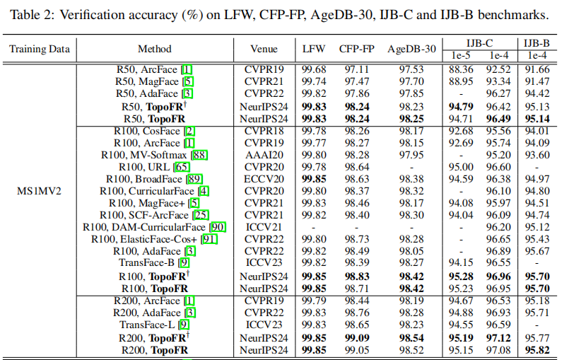
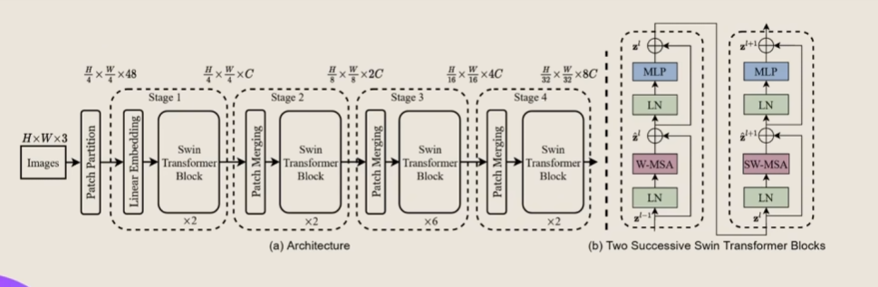
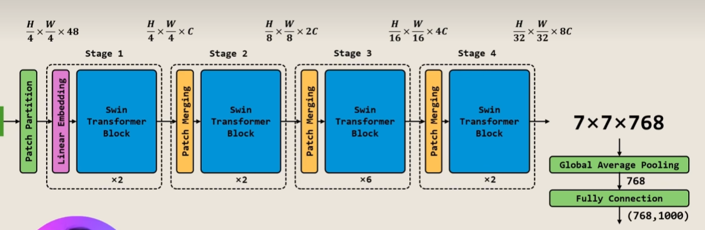

# 模型训练计划

## 参考资料

评估协议说明：

[AGE-DB评估协议说明.md](AGE-DB评估协议说明.md)

数据集下载地址：

[Dataset.md](Dataset.md)

# 当前SOTA：

# 模型训练计划：

## 命题组要求：只能使用通用预训练权重，以及不能使用成熟的人脸识别模型。

### 1.要用CNN只能使用Resnet-50，使用imgnet预训练权重（加快收敛）

可以模仿IR（对人脸进行改进的Resnet）要对原生Resnet进行魔改-难度大 但是在架构上创新 IR官方仓库：https://github.com/deepinsight/insightface，

但是你魔改之后原来预训练的权重就失效了 因为你的模型架构变化 权重全部失效了 或是根本加载不进去

### 2.使用基于Transformer架构的模型

#### 如Vit，swim-transformer

#### 最好使用swim-transformer，shift-window偏移窗口注意力机制，对细粒度的识别优于vit 目前主要方向就是弄这个。

下面是官方架构图

官方仓库：https://github.com/microsoft/Swin-Transformer

# 可分工的实验验证（动手跑实验）：

**基于人脸识别目前最优秀的损失函数，可以尝试使用下面几种损失函数：**

**Arcface**头：主要是修改最后的全连接网络，固定Margin.官方有基于vit做适配

[官方仓库](https://github.com/deepinsight/insightface/tree/master/recognition/arcface_torch)

**Adaface**头：主要是修改最后的全连接网络，基于图片质量的动态Margin（不清楚swim给出的特征归一化前的L2范数是否还与图片质量相关）

[官方仓库](https://github.com/mk-minchul/CVLface)

然后基于一个效果最好的单一损失函数进行下一步的时间损失函数的设计。

**实验设计**：

1. **实现****swim**-transformer 加上不同分类头
1. 跑通训练，跑通评估
1. 记录训练配置如epoch记录评估输出的准确率
1. 汇总分析

先尝试Adaface Arcface

**liu**：目前我正在尝试将swimv1-tiny+adaface损失 在训练集上跑30个epoch做预训练 然后在agedb-30验证任务上跑验证正确率指标 （尝试中） 

训练数据集使用 [Dataset.md](Dataset.md)

测试验证协议评估协议说明：

优秀论文中最常见的评估协议细节说明：

[AGE-DB评估协议说明.md](AGE-DB评估协议说明.md)

# 自定义评估协议........开发中

qwen --resume 839f2302-7de5-4bc1-bb67-f5509a682909
