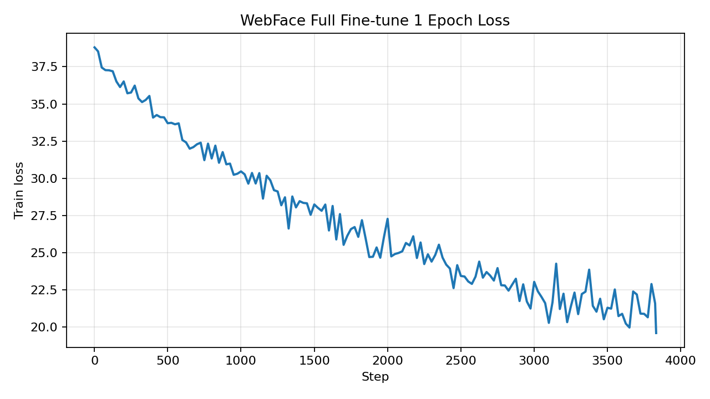
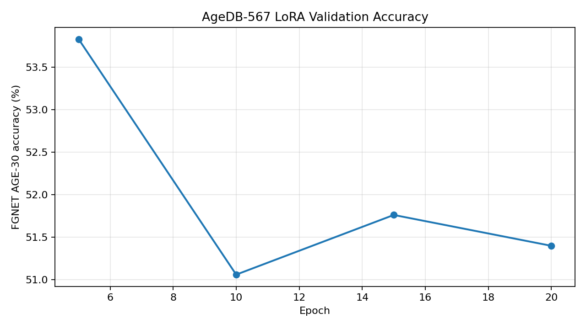

# Plan8 实验报告

生成时间：2026-04-16

## 数据与协议

| 项目 | 路径 | 说明 |
|---|---|---|
| WebFace-224 | `/root/Lab1/data/processed/webface_224` | 490,623 张，10,572 类 |
| AgeDB-567 train | `/root/Lab1/data/processed/agedb_harmonliu05_224_by_identity` | 16,488 张，567 类 |
| FGNET AGE-30 | `/root/Lab1/data/processed/fgnet_age30_protocol/facerec_val/fgnet_age30/pairs.csv` | 576 pairs，正负各 288 |
| AgeDB-30 | `/root/Lab1/data/processed/kaggle_verification_protocol/facerec_val/agedb_30/pairs.csv` | Kaggle verification protocol |

## 记录 1：WebFace 全量微调 1 epoch

| 字段 | 值 |
|---|---|
| checkpoint | `/root/Lab1/experiments/finetune_backbone_1epoch_bs128_amp/checkpoints/best.pt` |
| 微调方式 | Full backbone fine-tune，不是 LoRA |
| 训练集 | WebFace-224 |
| 训练图片/类别 | 490,623 / 10,572 |
| batch size | 128 |
| 训练 epoch | 1 |
| FGNET AGE-30 acc | 61.8119 ± 4.7253 |
| AgeDB-30 acc | 77.4500 ± 1.8679 |

## 记录 2：AgeDB-567 LoRA 训练 20 epoch

| 字段 | 值 |
|---|---|
| output dir | `/root/Lab1/experiments/agedb567_lora_r4_epochlog` |
| latest checkpoint | `/root/Lab1/experiments/agedb567_lora_r4_epochlog/checkpoints/latest.pt` |
| best checkpoint | `/root/Lab1/experiments/agedb567_lora_r4_epochlog/checkpoints/best.pt` |
| 微调方式 | LoRA qkv, r=4, alpha=4, dropout=0.1 + AdaFace head |
| 训练集 | AgeDB-567 224 by identity |
| 训练图片/类别 | 16488 / 567 |
| batch size | 128 |
| epoch | 20 |
| eval every | 5 epochs |
| FGNET AGE-30 best acc | 53.8324 @ epoch 5 |
| FGNET AGE-30 final acc | 51.4005 @ epoch 20 |
| AgeDB-30 best checkpoint acc | 65.6833 ± 1.4916 |
| AgeDB-30 latest checkpoint acc | 68.0000 ± 1.4720 |

### Epoch 指标

| epoch | train loss | FGNET AGE-30 acc |
|---:|---:|---:|
| 1 | 32.531555 | - |
| 2 | 28.764189 | - |
| 3 | 26.692592 | - |
| 4 | 25.264434 | - |
| 5 | 24.309642 | 53.832426 |
| 6 | 23.651641 | - |
| 7 | 23.056910 | - |
| 8 | 22.637068 | - |
| 9 | 22.256680 | - |
| 10 | 21.932623 | 51.061706 |
| 11 | 21.640183 | - |
| 12 | 21.345747 | - |
| 13 | 21.167910 | - |
| 14 | 20.935995 | - |
| 15 | 20.688374 | 51.763460 |
| 16 | 20.503101 | - |
| 17 | 20.326668 | - |
| 18 | 20.203347 | - |
| 19 | 19.991790 | - |
| 20 | 19.817646 | 51.400484 |

## 简要结论

1. WebFace 全量微调 1 epoch 在 FGNET AGE-30 上为 61.81%，在 AgeDB-30 上为 77.45%。
2. AgeDB-567 LoRA 训练 loss 从 32.5316 下降到 19.8176，但 FGNET AGE-30 accuracy 没有随 epoch 稳定提升，最好在 epoch 5，为 53.83%。
3. AgeDB-567 LoRA 的 latest checkpoint 在 AgeDB-30 上为 68.00%，高于 best checkpoint 的 65.68%。这里的 best 是按 FGNET 指标保存的，不是按 AgeDB-30 保存的。

## 产物

| 文件 | 说明 |
|---|---|
| `plan8_report.md` | 本报告 |
| `plan8_results.json` | 结构化结果 |
| `agedb_lora_epoch_loss.png` | AgeDB-LoRA epoch loss 曲线 |
| `agedb_lora_fgnet_acc.png` | AgeDB-LoRA FGNET AGE-30 acc 曲线 |
| `webface_full_1epoch_loss.png` | WebFace full fine-tune step loss 曲线 |
