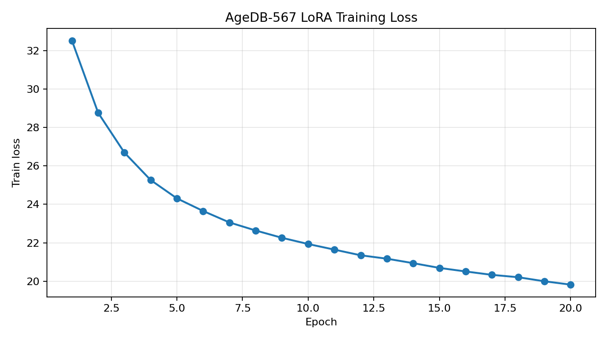

# 实验报告

[实验代码](https://huggingface.co/lhx05/lab1-cvlface-code)

# 概括

**同架构 swim-s+adaface头 不同训练数据集**

## webface

| **FGNET AGE-30 acc** | **61.8119 ± 4.7253** |
| -------------------- | -------------------- |
| **AgeDB-30 acc**     | **77.4500** ± 1.8679 |

## AgeDB

| FGNET AGE-30 best acc            | 53.8324 @ epoch 5    |
| -------------------------------- | -------------------- |
| **AgeDB-30 best checkpoint acc** | **65.6833 ± 1.4916** |

# 数据细节

## WebFace 全量微调 1 epoch

| 训练集               | WebFace-224          |
| -------------------- | -------------------- |
| 训练图片/类别        | 490,623 / 10,572     |
| batch size           | 128                  |
| 训练 epoch           | 1                    |
| **FGNET** AGE-30 acc | **61.8119** ± 4.7253 |
| **AgeDB**-30 acc     | **77.4500** ± 1.8679 |

## AgeDB-567 LoRA 训练 20 epoch

| 微调方式                     | LoRA qkv, r=4, alpha=4, dropout=0.1 + AdaFace head |
| ---------------------------- | -------------------------------------------------- |
| 训练集                       | AgeDB-567 224 by identity                          |
| 训练图片/类别                | 16488 / 567                                        |
| batch size                   | 128                                                |
| epoch                        | 20                                                 |
| eval every                   | 5 epochs                                           |
| FGNET AGE-30 best acc        | 53.8324 @ epoch 5                                  |
| AgeDB-30 best checkpoint acc | 65.6833 ± 1.4916                                   |

## 简要结论

1. WebFace 全量微调 1 epoch 在 FGNET AGE-30 上为 61.81%，在 AgeDB-30 上为 77.45%。
2. AgeDB-567 LoRA 训练 loss 从 32.5316 下降到 19.8176，但 FGNET AGE-30 accuracy 没有随 epoch 稳定提升，最好在 epoch 5，为 53.83%。
3. AgeDB-567 LoRA 的 latest checkpoint 在 AgeDB-30 上为 68.00%，高于 best checkpoint 的 65.68%。这里的 best 是按 FGNET 指标保存的，不是按 AgeDB-30 保存的。

[更多细节]( plan8_report.md)
